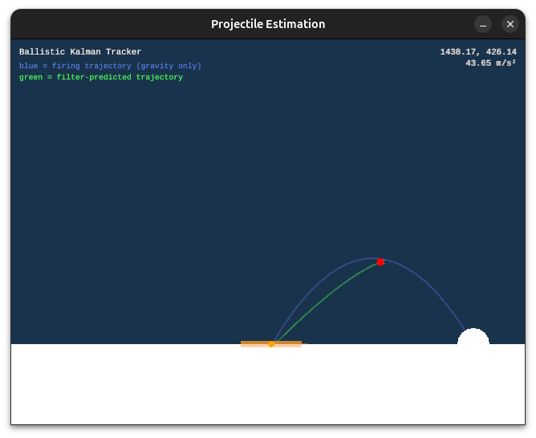

# Ballistics Estimation

[](https://github.com/sunsided/ballistics/actions/workflows/ci.yml)
[](https://github.com/sunsided/ballistics)

A small Rust/ggez playground that tracks a wind-perturbed projectile with a Kalman filter and predicts its impact zone on the ground via Monte-Carlo sampling of the filter's covariance.


*Blue = true firing trajectory (gravity only), Green = filter-predicted trajectory, Cyan dot + ellipse = state estimate with 1σ covariance, Orange bar + whiskers = predicted impact zone (±2σ with min/max).*

## What it does

- An opponent on the right edge fires projectiles with a random launch angle drawn from Normal(60°, 10°) clamped to 25°–80° and a speed of 100–120 m/s.
- Gravity (-9.81 m/s²) and a time-correlated wind model (sinusoidal base plus Ornstein–Uhlenbeck-style correlated noise on the x-axis) perturb the flight.
- The observer receives noisy 2D position measurements each physics tick (uniform noise, σ ≈ 5 px).
- A 6-state linear Kalman filter with state vector `[x, y, vx, vy, ax, ay]` (constant-acceleration model, dt-based state transition) is built on `minikalman`; the measurement matrix observes position only.
- Impact prediction runs 64 Monte-Carlo rollouts per update on a background thread: it Cholesky-decomposes the 4×4 position/velocity sub-covariance, draws Gaussian samples, propagates each sample until it crosses the ground (with a quadratic root-solve for the exact crossing time), and aggregates mean, std-dev, min, and max of the landing x to draw the impact zone.
- Game time is accelerated by `GAME_TIME_FACTOR = 10.0` at `PHYSICS_FPS = 60` for faster iteration.

## Running it

```bash
cargo run --release
```

The `resources/` directory containing `LiberationMono-Regular.ttf` must be present, as `main.rs` adds it as a resource path for text rendering.

## Ideas

- Can we estimate the mass of the projectile as well?
  - Both the mass and the initial firing force determine the acceleration.
  - The mass will affect the curvature of the trajectory.

## License

Licensed under the [European Union Public Licence v1.2 (EUPL-1.2)](https://joinup.ec.europa.eu/collection/eupl/eupl-text-eupl-12).
